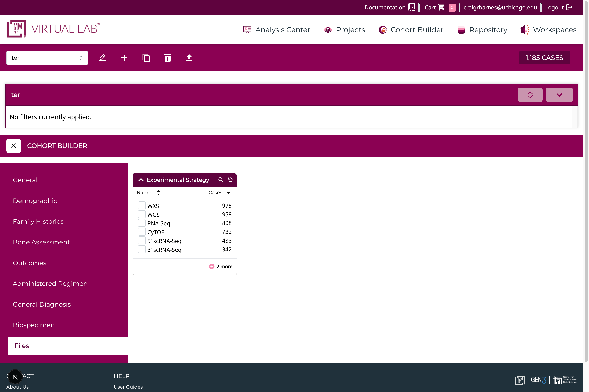

# Tabbed Cohort Builder Configuration

The tabbed cohort builder configuration page allows users to define the Tabs and which
facets are displayed in each tab. The configuration file is located
`src/features/apps/config/tabbedCohortBuilder.json`. This json file
is used to generate the tabbed cohort builder configuration page.

The format is as follows:

```json
{
  "index": "case_centric",
  "indexPrefix": "CaseCentric_",
  "fieldsAreFlat": true,
  "tabsConfiguration": {
    "general": {
      "label": "General",
      "facets": [
        "project.project_id",
        "primary_site",
        "disease_type"
      ],
      "fieldsConfig": {
        "project.project_id": {
          "description": "The project ID is a unique identifier assigned to each project.",
          "excludeValues": [
            "MMRF-IA11",
            "MMRF-IA12",
            "MMRF-IA13",
            "MMRF-IA14",
            "MMRF-IA15",
            "MMRF-IA16",
            "MMRF-IA17",
            "MMRF-IA18",
            "MMRF-IA19",
            "MMRF-IA20",
            "MMRF-IA21",
            "MMRF-IA22",
            "MMRF-IA23"
          ]
        },
        "primary_site": {
          "description": "The text term used to describe the primary site of disease, as categorized by the World Health Organization's (WHO) International Classification of Diseases for Oncology (ICD-O). This categorization groups cases into general categories. Reference tissue_or_organ_of_origin on the diagnosis node for more specific primary sites of disease."
        },
        "disease_type": {
          "description": "The text term used to describe the type of malignant disease, as categorized by the World Health Organization's (WHO) International Classification of Diseases for Oncology (ICD-O)."
        }
      },
      "queryOptions": {
        "index": "case_centric",
        "indexPrefix": "CaseCentric_"
      }
    },
    "demographic": {
      "label": "Demographic",
      "facets": [
        "demographic.gender",
        "demographic.race",
        "demographic.ethnicity",
        "demographic.age_at_index",
        "demographic.days_to_death",
        "diagnoses.age_at_diagnosis",
        "demographic.vital_status",
        "demographic.year_of_death",
        "follow_ups.ecog_performance_status"
      ],
      "queryOptions": {
        "index": "case_centric",
        "indexPrefix": "CaseCentric_"
      },
      "fieldsConfig": {
        "follow_ups.ecog_performance_status": {
          "description": "The subject's performance status (PS) score reported in its numeric format at the time of the visit. The ECOG PS is a determination of how well a subject is able to perform ordinary tasks and carry out daily activities."
        },
        "demographic.race": {
          "description": "Subject's race that was collected at baseline, study enrollment, for the US cohort only."
        },
        "demographic.vital_status": {
          "description": "The survival state of the person registered on the protocol. CDE: 5."
        },
        "demographic.ethnicity": {
          "field": "demographic.ethnicity",
          "description": "Text designations that identify biological sex."
        },
        "demographic.gender": {
          "label": "Sex",
          "field": "demographic.gender",
          "description": "Text designations that identify biological sex.",
          "type": "enum"
        },
        "diagnoses.age_at_diagnosis": {
          "label": "Age at Diagnosis",
          "field": "diagnoses.age_at_diagnosis",
          "type": "age_in_years",
          "description": "Age in days at which a condition or disease was first diagnosed. CDE: 3225640. TCGA has the age in years with CDE 2006657, this is converted by ceil(age*365.25) to get days.",
          "range": {
            "maximum": 32872,
            "minimum": 0,
            "step": 10
          }
        },
        "demographic.days_to_death": {
          "field": "demographic.days_to_death",
          "type": "days",
          "description": "Number of days between the date used for index and the date from a person's date of death represented as a calculated number of days.",
          "range": {
            "maximum": 32872,
            "minimum": 0,
            "step": 10
          }
        },
        "demographic.year_of_death": {
          "label": "Year of Death",
          "field": "diagnoses.age_at_diagnosis",
          "type": "year",
          "description": "The year component of the subject's date of death, if applicable. In a de-identified dataset, this variable will help with sequencing events.",
          "range": {
            "maximum": 2050,
            "minimum": 1950,
            "step": 10
          }
        },
        "demographic.age_at_index": {
          "label": "Age at Index",
          "field": "diagnoses.age_at_diagnosis",
          "type": "age",
          "description": "Subject's age at the time of first therapy for multiple myeloma diagnosis.",
          "range": {
            "maximum": 32507,
            "minimum": 0,
            "step": 10
          }
        }
      }
    },
    "family_histories": {
      "label": "Family Histories",
      "facets": [
        "family_histories.relatives_with_cancer_history_count"
      ],
      "fieldsConfig": {
        "family_histories.relatives_with_cancer_history_count": {
          "label": "Relatives With Cancer History",
          "field": "family_histories.relatives_with_cancer_history_count",
          "description": "Count of relatives with malignant cancer diagnosis derived from family history table.",
          "type": "numeric_range"
        }
      },
      "queryOptions": {
        "index": "case_centric",
        "indexPrefix": "CaseCentric_"
      }
    }
  }
}

```
The first two fields define which index to query and should be left as is.
The `fieldsAreFlat` field should be set to `true`.
The `tabsConfiguration` field defines the tabs and their associated facets.
where:
- `label` is the tab label
- `facets` is an array of facet that will be displayed in the tab.
- `fieldsConfig` is an optional object that allows to define a description for each facet. The allows for the label to be overwritten,as
    well as to add a description which will be displayed in the tooltip.
- The `type` field can be used to specify the type of the facet. The possible values are:
    - `enum`
    - `exact`
    - `range`
    - `age`
    - `age_in_years`
    - `year`
    - `years`
    - `days`
    - `percent`
    - `numeric_range`
    - `datetime`
    - `toggle`
    - `multiselect`
    - `upload`
Note that the `type` field is optional and defaults to `enum` if not specified.
- The `range` field can be used to specify the range of values for numeric facets.
    where:
        `maximum` is the maximum value of the range
        `minimum` is the minimum value of the range
        `step` is the step size of the range.
- The `excludeValues` field can be used to exclude specific values from enumerated facets.
- `queryOptions` is an optional object that allows to define the index and indexPrefix to query.
- `description` is an optional field that can be used to add a description to the facet that shows up in the tooltip on the facet card.
- `label` is an optional field that can be used to overwrite the label of the facet. You can use this to adjust capitalization or add a prefix.
These facets are based on the GDC facets: https://docs.gdc.cancer.gov/Data_Portal/Users_Guide/Developers_Guide/#facets

To add new facets to the configuration, add a new tab to the `tabsConfiguration` object.

For example, to add a new tab called "Files" with a single facet called "Experimental Strategy", the configuration would look like this:

```json
  "files": {
      "label": "Files",
      "facets": ["files.experimental_strategy"]
    }
```

And the cohort builder would look like this:

