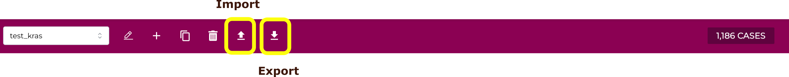

Cohorts can be exported and imported using the buttons on the Cohort Manager:

Export will create a .tsv file containing a list of case_id in the current cohort.
Import will import a .tsv file containing a list of case_id into the current cohort.
