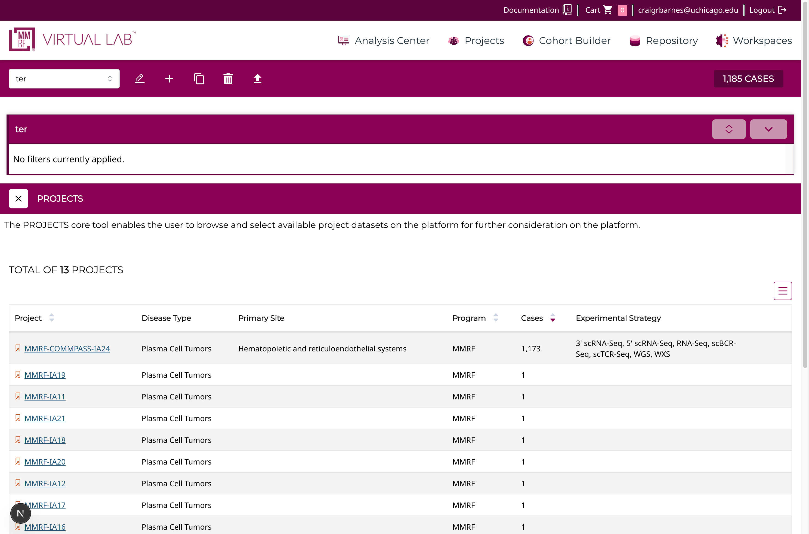

# Adding instructions to a Page

If you wish to add instructions to a page, you can do it by adding a React code
to a page. The apps main pages are located in `src/features/apps`.

So for example to add instructions on the 'Cohort Builder' page, you can add a
`<Instructions />` component to the `Projects App` component in `src/features/apps/Projects.tsx`.

```typescript
const ProjectsApp = () => {
  const isDemoMode = useIsDemoApp();
  return (
    <>
      {isDemoMode ? (
          <DemoUtil text="Demo mode is not available for this app" />
        ) : (
          <div className="flex flex-col">
          <Instructions message="The PROJECTS core tool enables the user to browse and select available project datasets on the platform for further consideration on the platform." />
            <ProjectsCenter />
            </div>
        )}
    </>
  );
};
```

which will render the following:


You can change the styling of the instructions by changing the `Instructions` component. The will ensure consistent styling across the platform.
